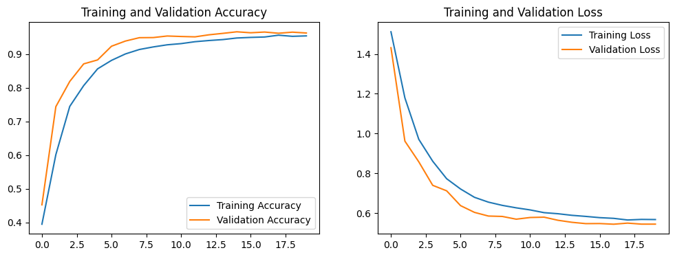
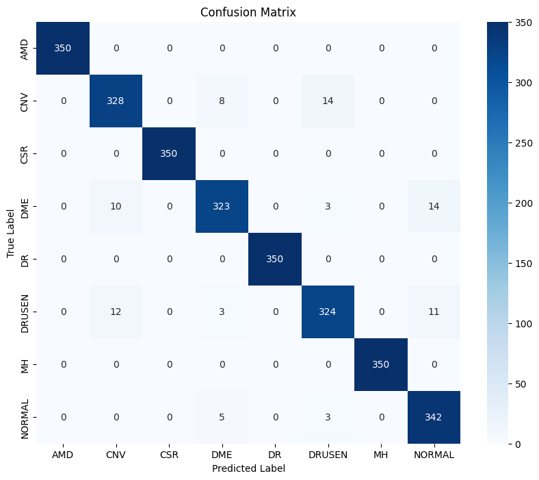

# Results

## Reported Experiment

The original experiment used 18,400 training images, 2,800 validation images, and 2,800 test images from Retinal OCT C8. The best validation Accuracy was 96.64% at epoch 15. The reported test Accuracy is 97.04%, with macro F1-score of 97.03%.

## Error Analysis

All 350 test images for AMD, CSR, DR, and MH were correctly classified. The most common confusions were:

| True class | Predicted class | Count |
| --- | --- | ---: |
| CNV | DRUSEN | 14 |
| DME | NORMAL | 14 |
| DRUSEN | CNV | 12 |
| DRUSEN | NORMAL | 11 |
| DME | CNV | 10 |

These categories can contain overlapping retinal fluid, elevation, and texture patterns. Future work should use patient-disjoint validation, external testing, and interpretable visualizations before drawing any clinical conclusion.

## Artifact Note

`figures/validation_loss.png` marks epoch 17 as the lowest validation loss. The model-selection rule is validation Accuracy, whose best epoch is 15. These are distinct criteria; the release code explicitly uses validation Accuracy.
